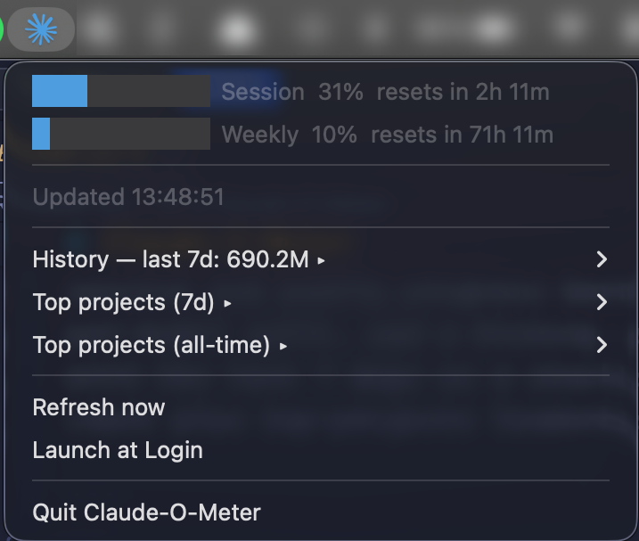

# Claude-O-Meter

A macOS menu bar app that shows your live Claude Code quota at a glance, plus a small history of past usage. The icon is the Claude mark, **colored half/half** — left half by your 5-hour session usage, right half by your 7-day weekly usage. Both halves shift through blue → green → orange → red as utilization climbs, so a quick glance tells you how much headroom you have.

Click the icon for the full breakdown: session and weekly progress bars and a history submenu with the last 7 days as a stacked bar chart plus top-projects leaderboards.



## Features

- **Live quota indicator** in the menu bar, split left/right between session and weekly utilization.
- **Pixel-rendered bars** in every menu row (no emoji), light/dark-mode aware.
- **Threshold notifications** at 75 / 90 / 95% so you know before you hit the wall.
- **Local history**: last 7 days as a stacked bar chart (input / output / cache write / cache read), plus top-projects leaderboards for the last 7 days and all-time.
- **Auto-update**: every 5 min in the background, no manual refresh button needed.
- **Launch at Login** via macOS's native SMAppService.
- **Token expiry handled gracefully**: shows `?` and a notification when your Claude Code OAuth token expires; recovers automatically on the next `claude login`.

## Install

### From a release (recommended)

1. Grab the latest `Claude-O-Meter.zip` from [Releases](../../releases/latest).
2. Unzip and move `Claude-O-Meter.app` to `/Applications`.
3. First launch: the binary is ad-hoc signed, not notarized, so macOS Gatekeeper will block it. **Right-click the app and choose Open** (not double-click). You'll see a "developer cannot be verified" dialog with an *Open* button — click it once. After that the app runs normally.

   *Alternative:* `xattr -d com.apple.quarantine /Applications/Claude-O-Meter.app` to clear the quarantine flag in one shot.

### From source

```sh
cargo install cargo-bundle --locked
./scripts/build_app.sh --open
```

Requires Rust 1.85+. The first build pulls in `resvg` / `usvg` / `tiny-skia` as build-only deps to rasterize the icon — slow once, then cached.

Running via `cargo run` works for development, but **notifications will silently fail** and **Launch at Login cannot register** — both require the binary to live inside an ad-hoc-signed `.app` bundle.

## First run

1. Make sure you've logged into Claude Code at least once (`claude login`) so the OAuth token is in your Keychain. Verify with:
   ```sh
   security find-generic-password -s "Claude Code-credentials"
   ```
2. Launch the app. macOS will prompt:
   *"Claude-O-Meter wants to access your confidential information stored in 'Claude Code-credentials' in your keychain."*
   Click **Always Allow** so the app can poll unattended.
3. The icon turns from a neutral state (`…` tooltip) to a colored Claude sparkle reflecting your current usage.

## How utilization maps to color

Each half of the icon is colored independently from `Band::from_fraction`:

| Utilization | Color  |
| ----------- | ------ |
| 0–49 %      | Blue   |
| 50–74 %     | Green  |
| 75–89 %     | Orange |
| 90 %+       | Red    |

The same palette is used for the in-menu Session and Weekly bars.

## Token expiry

OAuth tokens issued by `claude login` expire (currently ~8 h). When that happens the menu bar icon goes red, the tooltip reads `?`, and a one-time notification fires: *"Claude Code token expired — run `claude login`"*. The app re-reads the Keychain on every poll, so logging in again refreshes the data without restarting the app.

The app does **not** attempt to use the refresh token — the OAuth refresh endpoint is undocumented and Claude Code itself doesn't refresh in the background.

## Data sources

- **Live quota**: `GET https://api.anthropic.com/api/oauth/usage` with `Authorization: Bearer <oauth-token>` and `anthropic-beta: oauth-2025-04-20`. Same endpoint that backs `claude.ai/settings/usage`. Default poll interval 7 min; backs off exponentially on 429 (capped at 30 min, floored at 60 s).
- **History**: `~/.claude/projects/**/*.jsonl` — Claude Code's local transcript files. Scanned incrementally every 5 min (only files whose mtime changed are re-parsed). Aggregates cached at `~/Library/Application Support/com.cynkra.claude-o-meter/history.json` so restart is instant.

## Settings

Persisted to `~/Library/Application Support/com.cynkra.claude-o-meter/settings.json`:

```json
{
  "refresh_secs": 420,
  "idle_refresh_secs": 1200,
  "notify_session": true,
  "notify_weekly": true,
  "thresholds": [0.75, 0.9, 0.95],
  "notify_spike": true,
  "notify_spike_weekly": false,
  "spike_threshold_per_min": 0.02
}
```

`thresholds` fire when usage crosses absolute *levels*. `notify_spike` is a
separate early-warning for runaways: it fires (and stamps a red "!" badge on the
tray icon) when session usage *climbs* faster than `spike_threshold_per_min`
(fraction of quota per minute — `0.02` ≈ 2%/min, on pace to burn the whole 5h
session in ~50 min). Lower it to be more sensitive; raise it if you routinely run
heavy parallel agents. `notify_spike_weekly` extends spike detection to the 7-day
window (off by default — it's too slow-moving for velocity to be useful).

Edit and restart the app to apply.

## Development

```sh
cargo test                       # unit + wiremock integration tests
cargo clippy --all-targets
cargo run --example dump_token   # prints token preview + expiry from Keychain
```

End-to-end smoke:

```sh
./scripts/build_app.sh --open
log stream --predicate 'process == "claude_o_meter"'
```

Project layout:

```
src/
  main.rs            event loop, tray bootstrap, channel wiring
  api.rs             /api/oauth/usage client + scale-detection (0–1 vs 0–100)
  poller.rs          tokio task: poll, backoff, dispatch
  credentials.rs     Keychain read + token expiry check
  history.rs         JSONL scanner, mtime-incremental, per-day/project aggregates
  menu.rs            build dropdown from AppState
  bars.rs            pure-Rust RGBA bar renderer
  theme.rs           NSAppearance detection (light vs dark)
  icons.rs           menu bar icon, tinted alpha-mask of the Claude SVG
  notifications.rs   threshold-aware notify-rust wrapper
  launch_at_login.rs SMAppService wrapper
  settings.rs        JSON persistence
assets/
  claude_symbol.svg  Wikimedia CC0; rasterized at build time via build.rs
```

## Tech

- [`tray-icon`](https://docs.rs/tray-icon) + [`tao`](https://docs.rs/tao) — NSStatusItem and event loop
- [`reqwest`](https://docs.rs/reqwest) (rustls) + [`tokio`](https://docs.rs/tokio) — polling
- [`security-framework`](https://docs.rs/security-framework) — Keychain access
- [`mac-notification-sys`](https://docs.rs/mac-notification-sys) — native NSUserNotifications
- [`smappservice-rs`](https://docs.rs/smappservice-rs) — SMAppService launch-at-login
- [`objc2-app-kit`](https://docs.rs/objc2-app-kit) — NSAppearance / NSApp access for dark-mode detection
- [`cargo-bundle`](https://github.com/burtonageo/cargo-bundle) — `.app` packaging
- Icon: [Claude AI symbol](https://commons.wikimedia.org/wiki/File:Claude_AI_symbol.svg) (CC0, via Wikimedia). "Claude" is a trademark of Anthropic. The SVG is rasterized to an alpha mask at build time (`build.rs` uses `resvg` / `usvg` / `tiny-skia`) and tinted per utilization band at runtime — no SVG dependencies in the shipped binary.

## License

MIT — see [LICENSE](LICENSE).

This is an unofficial third-party tool. "Claude" and "Anthropic" are trademarks of Anthropic. Bug reports and PRs welcome.
